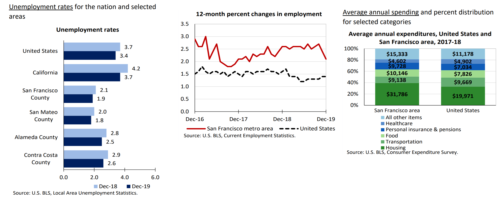
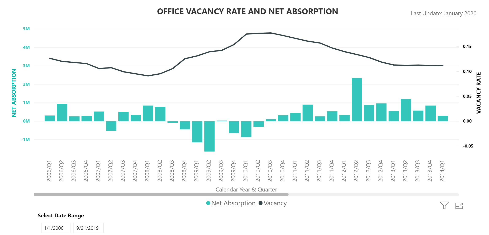

### Background

Food trucks are a common sight in the city of San Francisco.  Its popularity due to convenience, prices, variety, and availability makes them welcomed for office workers, some of whom do not have a long lunch hour.  

A prospective food truck operator might be able to glean some information from a certain commercial real estate metric that would allow him/her to anticipate where to locate their truck.

### Introduction

Commercial real estate (office space) square foot prices determine the likelihood of an increase/decrease in tenants.  A low rate might encourage businesses to lease the vacant space whereas a high rate might not.  The vacancy rate is very low leading to a city with one of the lowest unemployment rates in the country.

This could lead to a higher number of customers for someone looking to place a food truck facility.  For someone planning to decide which suitable site to place such facility, the prospects of low office rental rates may bring companies and along with it workers.  Thus, a potential increase in customers.

This study will also include a list of restaurant categories that are common to a particular neighborhood.  It is up to the client to decide whether having less common cuisine may entice fresh offerings to the area versus more common cuisine offering that assures familiarity might deliver a profitable strategy.  Restaurants present a main competitor to any food truck operator and this is where its mobility comes into focus.

The most suitable target audience for this study will be entrepreneurs planning to operate food trucks.  Due to its mobility, it can anticipate where to go based on the likelihood a neighborhood will have an increase in new businesses, in turn an increase in customers.  Food truck operators are required to apply for permits every year.  This includes the location of where the truck will be for the duration of the year.  In addition, certain locations can only accommodate a certain number of trucks.

*If one can anticipate where they would station their trucks for one year, then they can have a leg up on their competition by being the first or maybe the exclusive facility to serve at that location.*

### Data
The following data will be used to demonstrate the ability to identify potential location sites.

Commercial real estate square footage rates from 42floors.com.  This data shows the cost on a per square foot of vacant office space being charge to potential businesses.  Also from the same dataset, the median or average size of the office space, indicating how large of a workforce can work in a particular site.

Food truck permit data from DataSF.  It shows the number of food trucks currently operating and where (latitude, longitude) in the city.

Foursquare venue data to show current restaurant businesses in the neighborhood where the commercial estate vacancies are located.  The purpose is to discover the typical cuisine category that is common (will restrict to the top 5 from the list) or not common in the area.

#### References
www.sfgov.org/scorecards/economy/commercial-real-estate  
www.bls.gov/regions/west/summary/blssummary_sanfrancisco.pdf  
www.42floors.com/research/us/ca/san-francisco  
www.data.sfgov.org/Economy-and-Community/Mobile-Food-Facility-Permit/rqzj-sfat  
