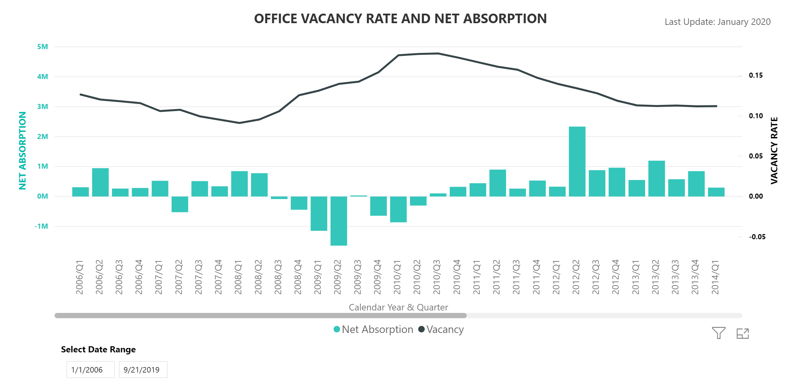
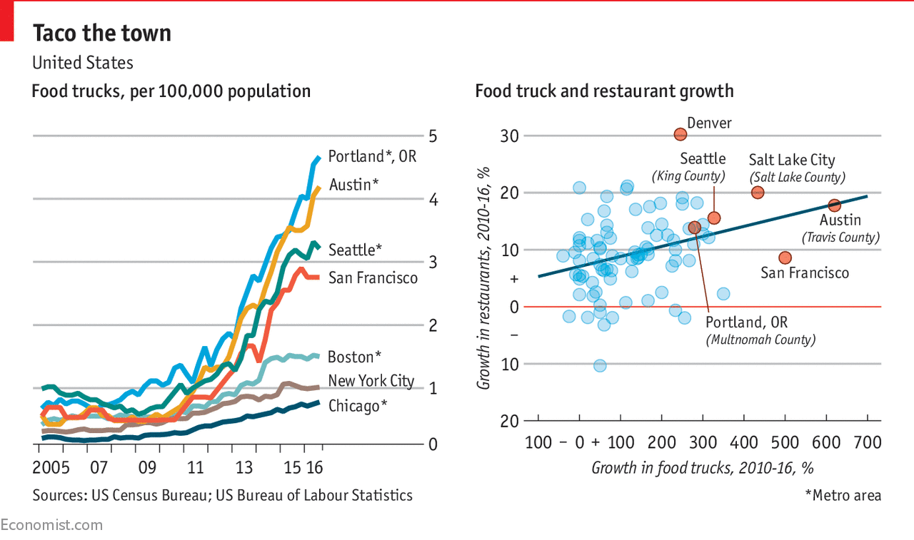
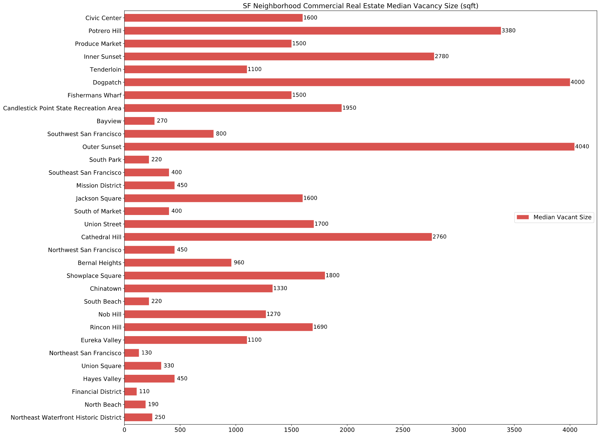

# 
IBM Coursera Capstone Project - Battle of Neighborhoods

## 
Where is lunch?

## 
by Precioso P Gabrillo III

### Background
Food trucks are a common sight in the city of San Francisco.  Its popularity due to convenience, prices, variety, and availability makes them welcomed for office workers, some of whom do not have a long lunch hour.

  
*courtesy Google images*

#### Problem Statement
*A prospective food truck operator can use the commercial real estate vacancy listing for potential new businesses in a particular neighborhood; thus, increasing lunch time customers.  This listing can potentially predict where to locate the food truck operating for the year.*

### Introduction
Commercial real estate (medium to large office space) square foot prices determine the likelihood of an increase/decrease in tenants.  A low rate might encourages businesses to lease the vacant space whereas a high rate might not.  The city has a very low unemployment and for the past 3 years a steady variation in unemployment.

*source bls.gov*

This could lead to a higher number of customers for someone looking to place a food truck facility.  For someone planning to decide which suitable site to place such facility, the prospects of low office rental rates may bring companies and along with it workers.  Moreover, the city has very low vacancy rates.  Thus, a potential sizeable number of customers.

*source sfgov.org*

The potential for customers exist.  Finding the location of where to place the food truck is what this study will determine.

To operate a food truck in the city of San Francisco, there are two considerations.  First, identify where the possible customers in a neighborhood.  Second, determine the two primary competitors: other food truck operators and restaurants.

Targeting lunch time customers during the week, the most potential customers will be office workers.  Secondarily, dinner time can also target the same customers.  However, being a new food truck operator means trying to join a crowded selection of food trucks, especially in certain neighborhoods.  In addition, traditional restaurants also hold major advantages on those closest to busiest areas.

Anticipating where possible business openings, low or no food trucks operating, and identifying existing cuisines serve in the neighborhood can be an advantage to placing a food truck operation.

*source Economist.com*

#### Target Audience
This study targets entrepreneurs planning to operate food trucks.  Due to its mobility, it can anticipate where to go based on the likelihood a neighborhood will have an increase in new businesses, in turn an increase in customers.  Food truck operators are required to apply for permits every year.  This includes the location of where the truck will be and how many hours during the day for the duration of the year.  Operators can apply and be approved at any given time so the number of operators changes daily.  In addition, certain locations can only accommodate a number of trucks for various reasons.

*If one can anticipate where they would station their trucks for one year, then they can have a leg up on their competition by being the first or maybe the exclusive facility to serve within that location.*

### Data
The following data will be used to demonstrate the ability to identify potential location sites.

Commercial real estate listing rates from 42floors.com.  This data shows the cost in US$ per square foot of vacant office space.  Also from the same dataset, the median or average size of the office space, indicating how large of a workforce can work in a particular site.

Food truck permit data from DataSF.  It shows the number of food trucks currently operating and where (latitude, longitude) in the city.

Foursquare venue data to show current restaurant businesses in the neighborhood where the commercial estate vacancies are located.  The purpose is to discover the typical cuisine category that is common (will restrict to the top 5 from the list) or not common in the area.

### Methodology
There are three datasets that will help answer the question of where to operate the food truck in the city of San Francisco.  The first dataset comes from a private company called 42floors.com and it contains the current (Jan. 2020) data for select neighborhoods (commonly defined within the commercial real estate market).  The second dataset comes from the city itself through its DataSF, the city's open data initiative.  In particular, the permit application data from every food truck operating in the city.  Because anyone can apply and be approved/denied at any given day, this dataset changes frequently.  The data dates from early March, 2020.  The final data comes from the Foursquare.com API.  The company is an "independent location data and technology platform."  It provides a way to extract a listing of restaurants operating in the city of San Francisco.

This project uses the Python Jupyter notebook to read, prepare, and visualize the datasets.  Both the vacancy & food truck datasets are read into the notebook while the Foursquare API collects the data on command.

The vacancy neighborhood dataset used "geopy.py" to locate the locations based on latitude & longitude.  It is a Python library "to locate the coordinates of addresses, cities, countries, and landmarks across the globe using third-party geocoders and other data sources."

#### Commercial Real Estate Vacancy Rates
Vacancy rates show the cost to lease an office space for a given area.  It lists the neighborhoods and its current market determining rates for office lease.  Another component of the data contains the median or average amount of empty space for lease within that neighborhood.  This shows how big of a space is available.  Both of these rates are the primary metric that provides guidance on where the likelihood of new businesses might start.

It was discovered upon using geopy.py that 3 of the listed neighborhoods and 1 other does not exist in Nominatim (a geolocation service used by geopy.py).  For the 3 neighborhoods, Nominatim suggested alternative names.  These did not alter the location of the neighborhoods.  The fourth neighborhood does not exist so an alternate name was used to extract the coordinates.  The neighborhood name was associated with the newfound coordinates and placed in the dataset.  Appendix B lists the names of the neighborhood.

A horizontal bar chart displays the comparison in lease rates between the differing neighborhoods.  The median rate shows the varying neighborhood on an increasing lease rates.  The next chart displays the same order of neighborhood listing.  The reason is to keep the neighborhood order for both charts for easy comparison.

#### Food Truck Permits
The permit dataset contains over 600 food truck applicants.  It contains the registered business names, dates the permit is effective, expiration dates, hours of operations, operation location in street address, latitude, & longitude form.  However, this data changes frequently so it carries new applicants who have not been approved.  Just over 500 rows exist when filtered for approved applicants.

To better understand where the trucks might be operating, only the business names, latitude, & longitude columns are extracted.  A map shows the locations.

#### Foursquare API
The vacancy dataset does not contain location coordinates.  Using the geopy coordinates instead, the Foursquare API searches for neighborhood restaurants up to a radius of 500 meters.  A list of 25 restaurants is representative of the variety of differing cuisines.  The list of common offerings is shown in Appendix A.

#### Food Truck Clusters
To evaluate the food truck locations, clustering their location with respect to each neighborhood will give an idea of how concentrated or not when considering a location.  The k-means clustering algorithm is simple enough for identifying the areas of interest.  It is one of the simplest and easiest to implement and provides the cluster a clear display on the map.

#### Map
An additional Python library, folium, displays the map of the food truck locations, neighborhood locations, a combination of the two maps, and the clusters of food trucks within a neighborhood.

### Results

*Map showing the central location of each neighborhood from the office vacancy listing.*
*Food truck locations in the city of San Francisco in 2020.*
*Food truck locations by neighborhood.*
*Food truck clusters.  Note the concentration in the eastern corridor.*
*Food truck clusters within the neighborhoods.*

### Discussion
The most obvious observations from the map clusters are the concentration of food trucks in the eastern section of the city.  This starts from the industrial section moving north through the Bay Bridge and into Fisherman's Wharf.  This section includes the industrial region, ports, the newly constructed Chase Center (home of a professional basketball team), Mission Bay, SBC Park (home of a professional baseball team), Ferry Building (majority of the area's ferry docks here), Downtown SF, Financial District, start up hubs, Chinatown, & Fisherman's Wharf.  These locations are considered the city's main tourist attractions.
*Downtown San Francisco*

On the opposite side of the city (west) is the lack of food trucks.  One reason could be due to the area as a suburb with high density residential buildings and family homes.  It also contains parks with some located on a hill.
*Sunset neighborhoods.*

There are clusters around the middle, just south of Golden Gate Park where a shopping center, a major hospital and research facility, & main entry way to the park for various major city events.
*Golden Gate Park neighborhoods.*

Another concentration can be found south of Presidio Park, the north-central part of the city.  This area includes museums, entrances to Presidio Park, a major company headquarters, & frequent weekend neighborhood events.  Besides the company headquarters, there are no large office spaces that are considered for this study; thus, no marker in this area.
*North-Central neighborhoods.*

While examining the chart for vacancy rates, the west side has plenty of office space for lease, Outer Sunset & Inner Sunset.  In addition, Dogpatch and Potrero Hill also have large amounts of available office spaces.
*Industrial neighborhoods east of the highways.*

The two sections of the city could never be more opposite.  The west side is predominantly family homes, small shopping centers, parks, & schools.  On the other hand, Dogpatch and Potrero Hill are high density and less affluent residential neighborhoods.  It is also the industrial area or what is left of that industry in the city.  It is where the port of San Francisco operates its merchant and non-passenger shipping.

Besides the heavy concentration of food trucks in the downtown, financial district, & eastern corridor, the low number of available office space from downtown towards the northern part also shows sparse food truck sites.  This area contains the city's majority of tourist points of interest.  It is expected to have a high number of restaurants that primarily targets city tourists and may reduce the potential for food truck customers.
*North East neighborhoods.*

Thus, there are two good locations that not only provide office workers as food truck customers but also other types of potential customers.

*SF Civic Center reference area.*
*SF Civic Center*  

The civic center location can provide potential increase number of food truck customers due to its low office lease rates and average space availability.  It can become an attractive location for new business.  Also, it does not have a large concentration of food trucks.  Currently showing 4 food truck operators in a 4x4 city blocks.  

As the city's civic center, there is a potential number of customers working from government buildings.  There are several colleges as well that includes office workers and students as customers.  Another benefit shows its distance walkable from major office areas on neighboring districts but distanced enough from other food truck operators.

The second potential truck location is the north-east section of the city.  Its vacancy rate is a little higher but its potential to land new businesses is just as enticing as the civic center neighborhood.  Being a tourist location, potential customers can include non office workers.  Most importantly, a lack of food truck operators together with imaginative offerings may deem the area suitable.
*North East neighborhoods.*

### Conclusion
Civic Center holds the most potential for a future food truck site because it has the lowest business office vacancy rate and a relative average office space availability.  For placing the food truck at this location for a year, possible addition of non office workers as a customer base will alleviate the problem of non mobility.  In addition, people working in government, students from colleges, and close proximity to the major office spaces at other neighborhoods but far enough from other food truck operators provide all the benefits of operating at this site.

The same can be said of the second potential site, from Jackson Square to Fisherman's Wharf.  Similar to the civic center neighborhood in office vacancy rate and space availability, the area has the potential for new office workers and is a major tourist attractions that provides additional customers.

With the sites chosen, the type of cuisine to serve will also provide an increase in customer interest.  The table shown in the Appendix A lists the most common type of restaurant and its cuisine within that neighborhood.  Should a cuisine not on the list be profitable to offer or should another cuisine in common with most restaurants a desired strategy.

For the civic center neighborhood, cuisine in common in the area can be suitable because the customers are mostly workers and students while not too congested with food trucks.  On the other hand, the tourist area should have a food truck that offers cuisine not in common with the surrounding established traditional restaurants in order to differentiate and attract additional customers who are not from the area.

#### Appendix A
List of common restaurant type found around the neighborhood where there are commercial real estate listings.
<!-- comment block -->
<!-- end comment block -->
<table border="1" class="dataframe">
  <thead>
    <tr style="text-align: right;">
      <th></th>
      <th>1st Most Common Venue</th>
      <th>2nd Most Common Venue</th>
      <th>3rd Most Common Venue</th>
      <th>4th Most Common Venue</th>
      <th>5th Most Common Venue</th>
    </tr>
    <tr>
      <th>Neighborhood</th>
      <th></th>
      <th></th>
      <th></th>
      <th></th>
      <th></th>
    </tr>
  </thead>
  <tbody>
    <tr>
      <th>Bayview</th>
      <td>Chinese Restaurant</td>
      <td>Food</td>
      <td>Food Court</td>
      <td>Japanese Restaurant</td>
      <td>Italian Restaurant</td>
    </tr>
    <tr>
      <th>Bernal Heights</th>
      <td>Latin American Restaurant</td>
      <td>Food</td>
      <td>Mexican Restaurant</td>
      <td>Peruvian Restaurant</td>
      <td>Vietnamese Restaurant</td>
    </tr>
    <tr>
      <th>Cathedral Hill</th>
      <td>American Restaurant</td>
      <td>Food</td>
      <td>Restaurant</td>
      <td>Italian Restaurant</td>
      <td>Thai Restaurant</td>
    </tr>
    <tr>
      <th>Chinatown</th>
      <td>Chinese Restaurant</td>
      <td>American Restaurant</td>
      <td>Asian Restaurant</td>
      <td>Dim Sum Restaurant</td>
      <td>Sushi Restaurant</td>
    </tr>
    <tr>
      <th>Civic Center</th>
      <td>Food</td>
      <td>Chinese Restaurant</td>
      <td>Vietnamese Restaurant</td>
      <td>Asian Restaurant</td>
      <td>New American Restaurant</td>
    </tr>
    <tr>
      <th>Dogpatch</th>
      <td>Food</td>
      <td>Bar</td>
      <td>Latin American Restaurant</td>
      <td>Asian Restaurant</td>
      <td>French Restaurant</td>
    </tr>
    <tr>
      <th>Eureka Valley</th>
      <td>Food</td>
      <td>Thai Restaurant</td>
      <td>Restaurant</td>
      <td>Japanese Restaurant</td>
      <td>Diner</td>
    </tr>
    <tr>
      <th>Financial District</th>
      <td>Chinese Restaurant</td>
      <td>Food</td>
      <td>Thai Restaurant</td>
      <td>Seafood Restaurant</td>
      <td>American Restaurant</td>
    </tr>
    <tr>
      <th>Fishermans Wharf</th>
      <td>Seafood Restaurant</td>
      <td>Italian Restaurant</td>
      <td>Food</td>
      <td>Breakfast Spot</td>
      <td>Hotel Bar</td>
    </tr>
    <tr>
      <th>Hayes Valley</th>
      <td>Food</td>
      <td>Corporate Cafeteria</td>
      <td>Italian Restaurant</td>
      <td>French Restaurant</td>
      <td>American Restaurant</td>
    </tr>
    <tr>
      <th>Inner Sunset</th>
      <td>Sushi Restaurant</td>
      <td>Chinese Restaurant</td>
      <td>Pizza Place</td>
      <td>Thai Restaurant</td>
      <td>Peruvian Restaurant</td>
    </tr>
    <tr>
      <th>Jackson Square</th>
      <td>Chinese Restaurant</td>
      <td>American Restaurant</td>
      <td>Asian Restaurant</td>
      <td>Dim Sum Restaurant</td>
      <td>Italian Restaurant</td>
    </tr>
    <tr>
      <th>Mission District</th>
      <td>Food</td>
      <td>Mexican Restaurant</td>
      <td>Latin American Restaurant</td>
      <td>Chinese Restaurant</td>
      <td>Filipino Restaurant</td>
    </tr>
    <tr>
      <th>Nob Hill</th>
      <td>Chinese Restaurant</td>
      <td>American Restaurant</td>
      <td>Mediterranean Restaurant</td>
      <td>Restaurant</td>
      <td>Indian Restaurant</td>
    </tr>
    <tr>
      <th>North Beach</th>
      <td>Chinese Restaurant</td>
      <td>Italian Restaurant</td>
      <td>Food</td>
      <td>Dim Sum Restaurant</td>
      <td>Restaurant</td>
    </tr>
    <tr>
      <th>Northeast San Francisco</th>
      <td>Food</td>
      <td>Chinese Restaurant</td>
      <td>New American Restaurant</td>
      <td>Vietnamese Restaurant</td>
      <td>Mexican Restaurant</td>
    </tr>
    <tr>
      <th>Northeast Waterfront Historic District</th>
      <td>Chinese Restaurant</td>
      <td>Seafood Restaurant</td>
      <td>Szechuan Restaurant</td>
      <td>Pub</td>
      <td>French Restaurant</td>
    </tr>
    <tr>
      <th>Northwest San Francisco</th>
      <td>Food</td>
      <td>Chinese Restaurant</td>
      <td>New American Restaurant</td>
      <td>Vietnamese Restaurant</td>
      <td>Mexican Restaurant</td>
    </tr>
    <tr>
      <th>Outer Sunset</th>
      <td>Sushi Restaurant</td>
      <td>Wine Bar</td>
      <td>Food</td>
      <td>Italian Restaurant</td>
      <td>Irish Pub</td>
    </tr>
    <tr>
      <th>Produce Market</th>
      <td>Mexican Restaurant</td>
      <td>Food</td>
      <td>Latin American Restaurant</td>
      <td>Vietnamese Restaurant</td>
      <td>Chinese Restaurant</td>
    </tr>
    <tr>
      <th>Rincon Hill</th>
      <td>New American Restaurant</td>
      <td>Lounge</td>
      <td>Restaurant</td>
      <td>Asian Restaurant</td>
      <td>Breakfast Spot</td>
    </tr>
    <tr>
      <th>Showplace Square</th>
      <td>American Restaurant</td>
      <td>Seafood Restaurant</td>
      <td>Café</td>
      <td>Hunan Restaurant</td>
      <td>Restaurant</td>
    </tr>
    <tr>
      <th>South Beach</th>
      <td>American Restaurant</td>
      <td>Asian Restaurant</td>
      <td>Italian Restaurant</td>
      <td>Breakfast Spot</td>
      <td>Brewery</td>
    </tr>
    <tr>
      <th>South Park</th>
      <td>American Restaurant</td>
      <td>Italian Restaurant</td>
      <td>Sandwich Place</td>
      <td>Asian Restaurant</td>
      <td>Breakfast Spot</td>
    </tr>
    <tr>
      <th>South of Market</th>
      <td>Lounge</td>
      <td>Food</td>
      <td>Italian Restaurant</td>
      <td>Restaurant</td>
      <td>Chinese Restaurant</td>
    </tr>
    <tr>
      <th>Southeast San Francisco</th>
      <td>Food</td>
      <td>Chinese Restaurant</td>
      <td>New American Restaurant</td>
      <td>Vietnamese Restaurant</td>
      <td>Mexican Restaurant</td>
    </tr>
    <tr>
      <th>Southwest San Francisco</th>
      <td>Food</td>
      <td>Chinese Restaurant</td>
      <td>New American Restaurant</td>
      <td>Vietnamese Restaurant</td>
      <td>Mexican Restaurant</td>
    </tr>
    <tr>
      <th>Tenderloin</th>
      <td>Vietnamese Restaurant</td>
      <td>Indian Restaurant</td>
      <td>Chinese Restaurant</td>
      <td>Food</td>
      <td>Thai Restaurant</td>
    </tr>
    <tr>
      <th>Union Square</th>
      <td>American Restaurant</td>
      <td>Indian Restaurant</td>
      <td>Sushi Restaurant</td>
      <td>Hotel</td>
      <td>New American Restaurant</td>
    </tr>
    <tr>
      <th>Union Street</th>
      <td>Chinese Restaurant</td>
      <td>Italian Restaurant</td>
      <td>Food</td>
      <td>Strip Club</td>
      <td>Greek Restaurant</td>
    </tr>
  </tbody>
</table>

#### Appendix B  
List of neighborhoods according to the CRE lease rate dataset.  
Bayview, Bernal Heights, Candlestick Point State Recreation Area, Cathedral Hill, Chinatown, Civic Center, Dogpatch, Eureka Valley, Financial District, Fisherman's Wharf, Hayes Valley, Inner Sunset, Jackson Square, Mission District, Nob Hill, North Beach, Northeast San Francisco, Northeast Waterfront Historic District, Northwest San Francisco, Outer Sunset, Potrero Hill, Produce Market, Rincon Hill, Showplace Square, South Beach, South Park, South of Market, Southeast San Francisco, Southwest San Francisco, Tenderloin, Union Square, Union Street

#### References
www.sfgov.org/scorecards/economy/commercial-real-estate
www.bls.gov/regions/west/summary/blssummary_sanfrancisco.pdf
www.42floors.com/research/us/ca/san-francisco
www.data.sfgov.org/Economy-and-Community/Mobile-Food-Facility-Permit/rqzj-sfat
www.economist.com/graphic-detail/2017/05/04/americas-food-truck-industry-is-growing-rapidly-despite-roadblocks  
Coursera IBM courses.
