## 
IBM Coursera Capstone Project - Battle of Neighborhoods

### 
Where is lunch?

### 
Presentation by Precioso P Gabrillo III

---
#### San Francisco, USA  
Moving around [San Francisco][1], I always see at least one food truck either parked and open for business or driving somewhere.  As you can see in the map below, the number of food trucks permitted to operate in the city is numerous and concentrated.

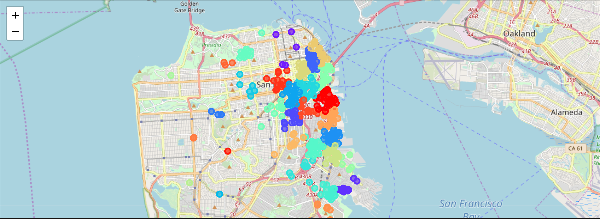*Food truck clusters.  Note the concentration in the eastern corridor.*

I wondered, what do I do to start one?  My supposition is that most food trucks serve lunch time customers as this is the most suitable match in terms of numbers and mobility.  Dinner times can be just as good a time for any food trucks to serve hungry customers.  Weekends are difficult to offer due to the low concentration of customers.  Only during events can I find large crowds as potential customers but the competition from food truck operators is high.

So targeting office workers is easy as I can spot places where they work.  However, there are already other food truck operators ahead of me.  So how do I find a location where no one else has found.  I decided to look at commercial office retail vacancy space as a possible window to anticipate where and how large the number of customers can be serve.

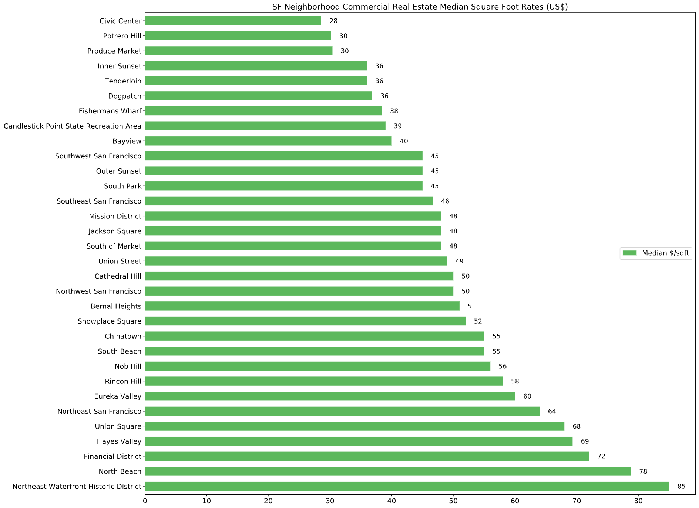
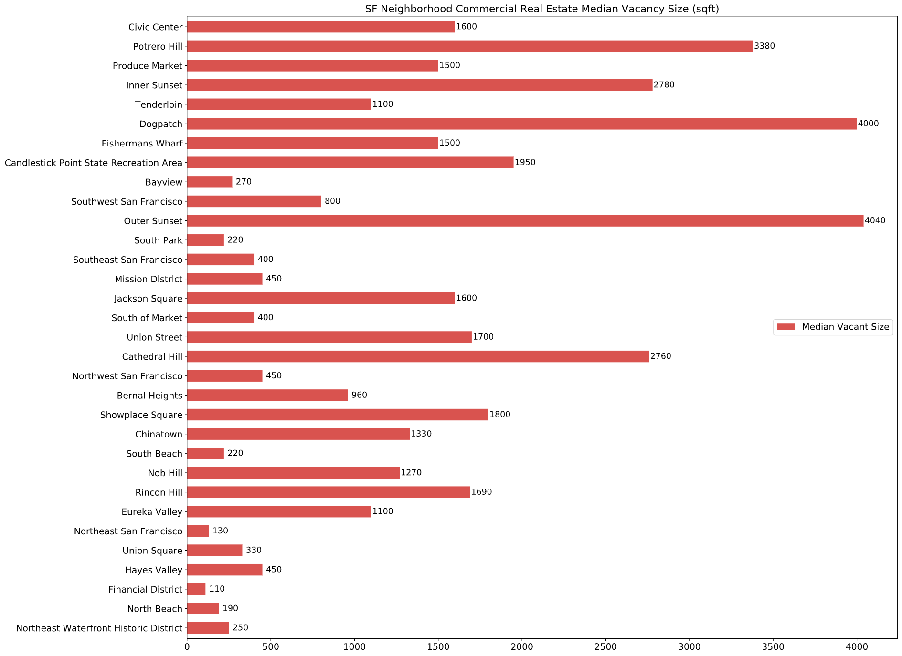

Another discovery is that a food truck stays in one location for a year, the duration of the permit.  And every year, a permit must be re-applied.  The city of San Francisco might call it "Mobile Food Facility" but the truck must be operating in that same location for the year.

So, the potential for having customers and possibly many more is important.  Finding the trend of where business might start is one way of anticipating a possible food truck site.
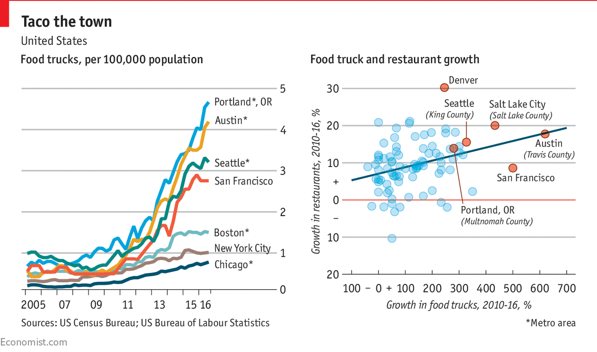*source Economist.com*

#### The Data
After searching for possible sources of data, I found 42floors.com and it has the needed data to glean on: Commercial Real Estate (CRE) Median Lease Rates.  I used a Jupyter notebook using Python to perform exploratory data analysis and visualization.

Using Python Pandas, I loaded the file, verified the types of data and the names of the neighborhood.  I decided on horizontal bar charts because the location names are long and so it would be easier to read horizontally.  The median vacant size chart was not re-sorted but kept the names similar to the median rate chart in order to easily compare line by line.
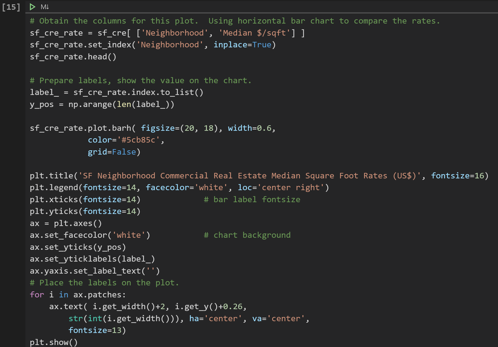

Another dataset I loaded using Pandas is the SF Mobile Food Facility Permit data.  This contains all the needed information on how to determine the site of each truck.  It contains the latitude and longitude in the dataset so all I had to do was extract 3 columns: names, latitude, & longitude.
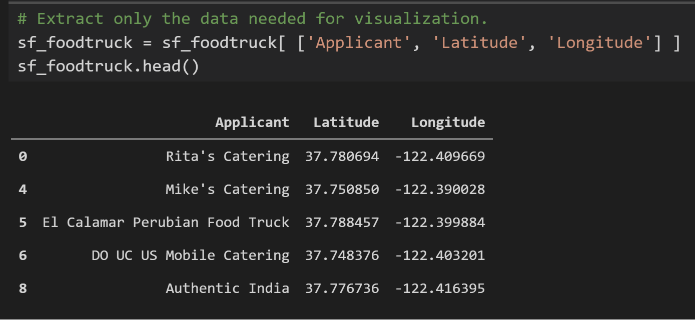

#### The Map
For mapping, I used the folium library.

I used the geopy.py library to get the latitude and longitude of the neighborhood names found in the CRE dataset.  However, geopy uses Nominatim and it could not find 4 names.  For 3 of those names, it recommended an alternate name that closely matches the location.  The fourth could not be found for whatever reasons.  So I used Google for coordinates.
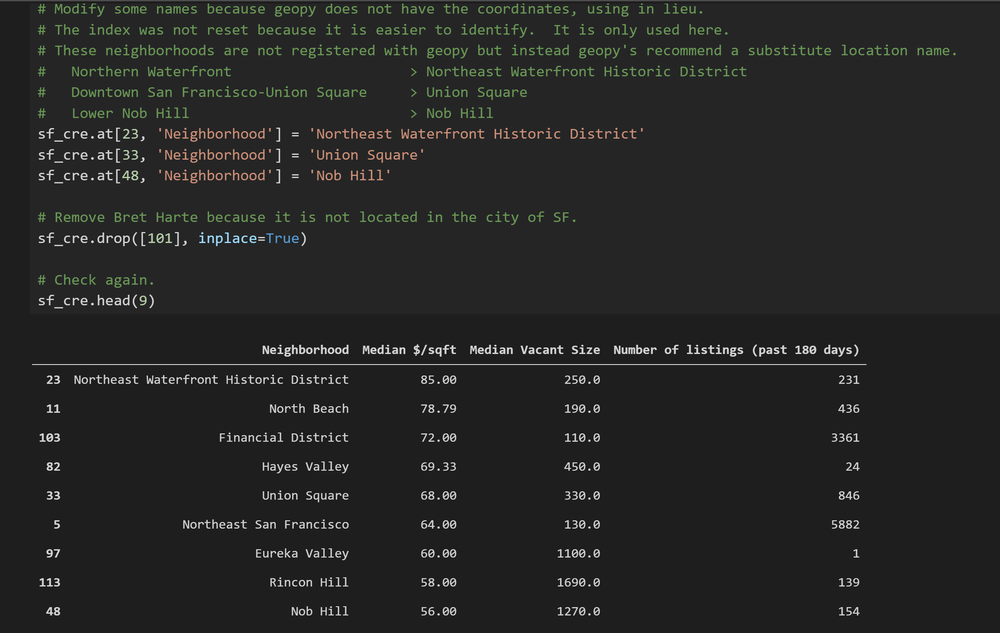

I removed the name and ran geopy for the entire list.  I then reloaded the missing name along  with the coordinates.
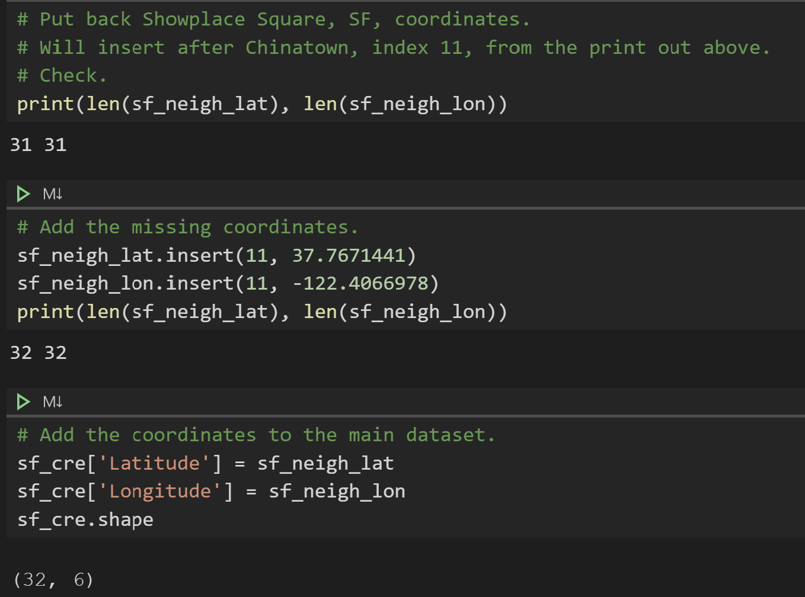

As for the permit dataset, the 3 column data was used as the training set for the k-means clustering algorithm.  The intent is to show the cluster of food trucks within a given neighborhood.  In this way, I can see how many food trucks are in the vicinity of vacant offices.
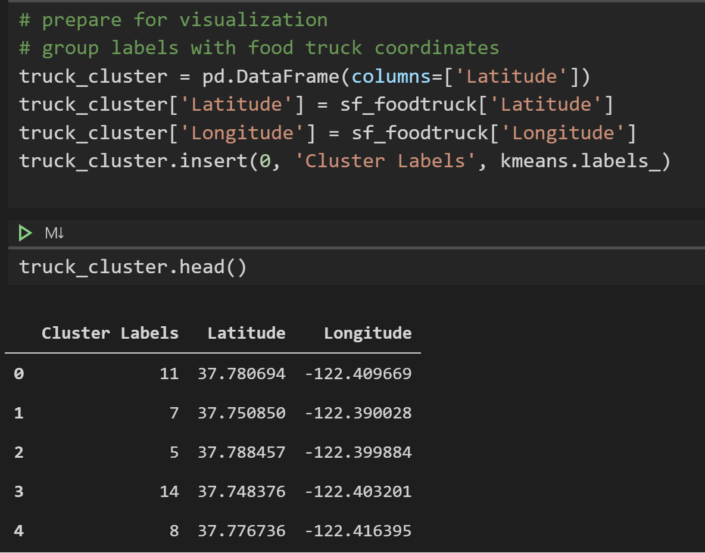
*SF Civic Center*

To obtain the list of restaurant in a given neighborhood (this was the hard part), I had to break down the steps in 3 ways.  The first is to prepare the Foursquare API to retrieve the list.  Next, using the course lab codes, I parse the list to obtain the top 5 common restaurant cuisines.  The last step is to prepare the table showing the list.  See Appendix A of the report for the table listing the top 5 common restaurant cuisines.

The final map shows the neighborhood where the office space vacancy is located along with a cluster of food trucks.
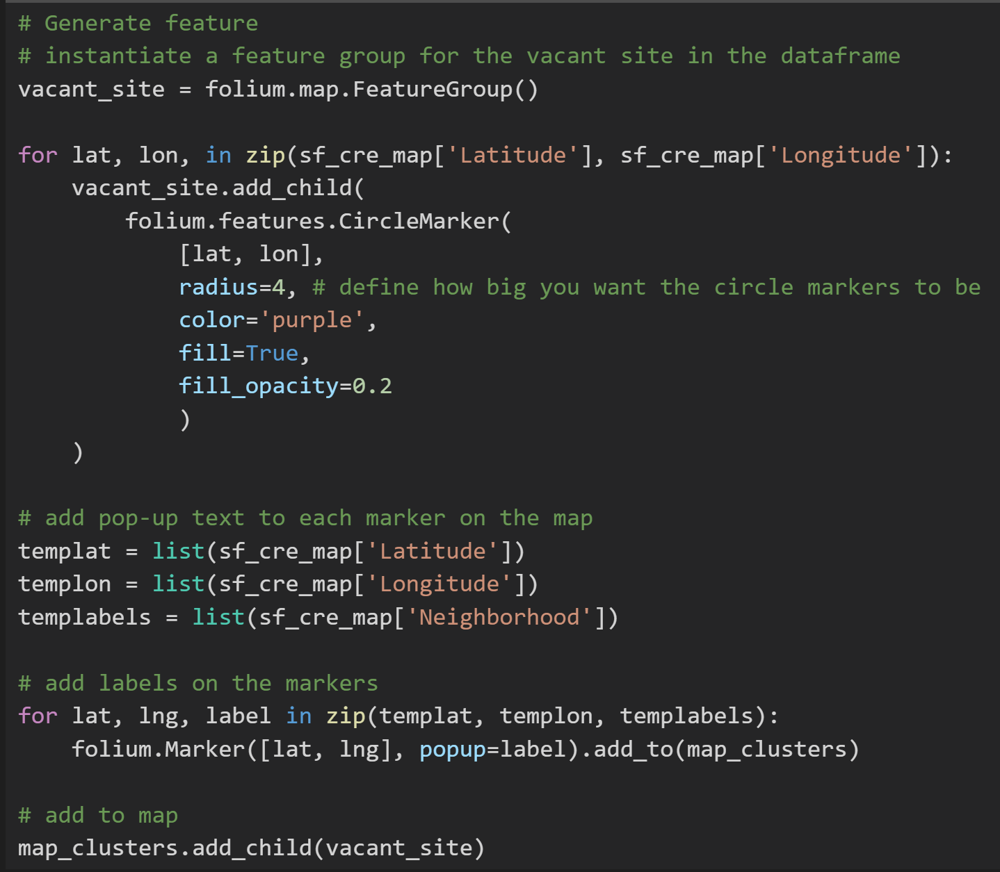
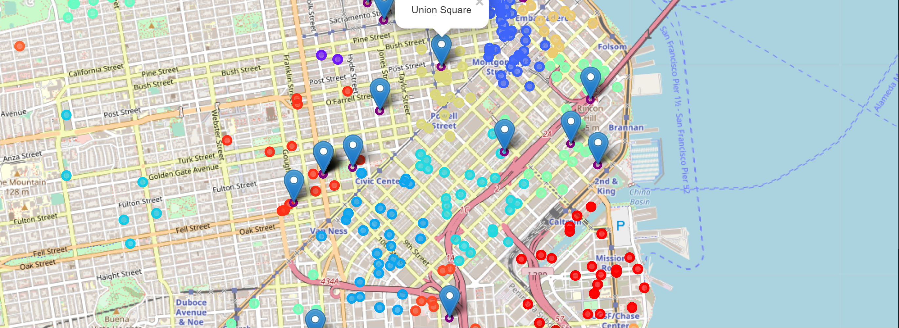*Downtown San Francisco*

[1]: <https://www.google.com/search?q=food+truck+culture+san+francisco&source=lnms&tbm=isch&sa=X&ved=2ahUKEwiN6oqx_p3oAhUF2qwKHRTSCZs4ChD8BSgCegQIDBAE> "SF Food Truck Culture"
